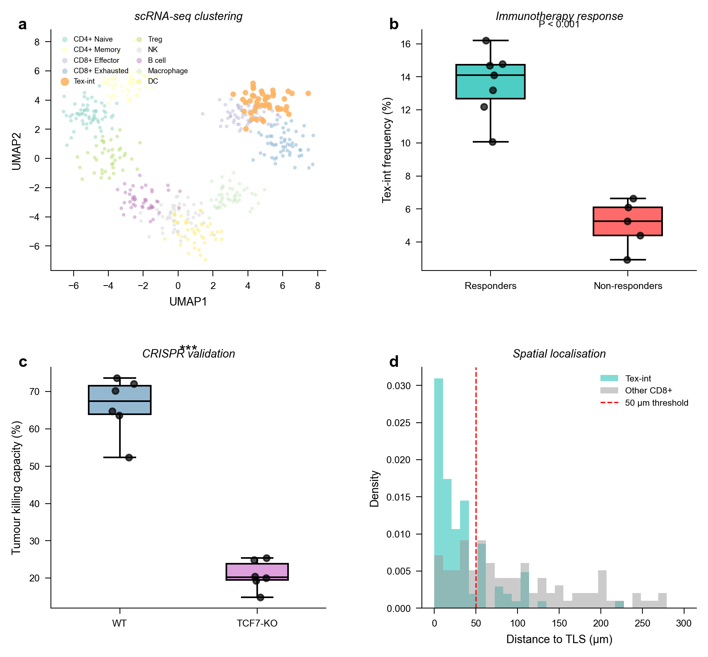
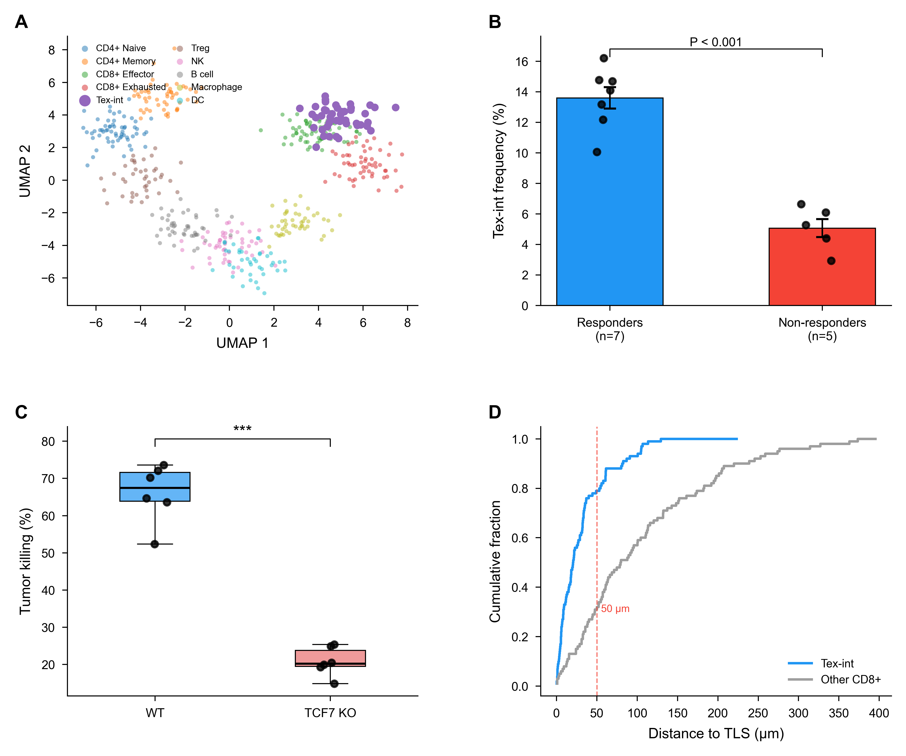
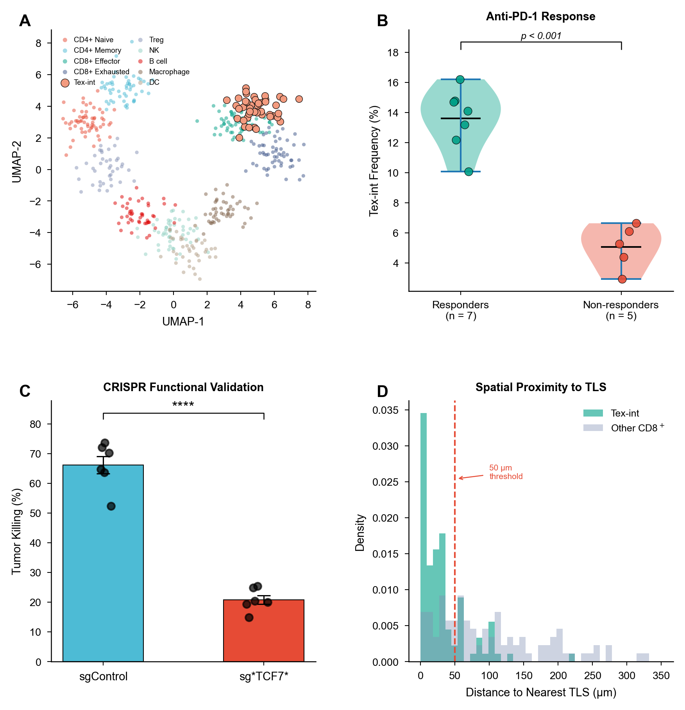

# 🧫 Cell-Skills — Cell Press 期刊家族学术写作与投稿技能包

[English Version](README.en.md)

[](./LICENSE)
[]()
[]()

---

## 简介 | Introduction

**Cell-Skills** 是一套专为 [Cell Press](https://www.cell.com/) 期刊家族设计的 AI 辅助学术写作技能包，覆盖 Cell、Molecular Cell、Cell Stem Cell、Cell Reports、Cell Systems、Cell Chemical Biology、Cell Host & Microbe、Immunity、Neuron、Developmental Cell、Current Biology 等顶级期刊。

本技能包严格遵循 Cell Press 的投稿规范，包括：
- **Summary**（非 Abstract）：≤150 词，不含引用
- **STAR Methods**（Structured, Transparent, Accessible Reporting）
- **Key Resources Table**（必填）
- **Graphical Abstract**（所有 Cell Press 文章必须提供，1200×1200px）
- **Highlights**：3–4 条，每条 ≤85 字符
- **eTOC Blurb**：约 40 词的通俗语言摘要
- **Lead Contact**（非 Corresponding Author）

---

## 📊 效果展示：Nature vs Science vs Cell 三方对比

> 使用同一组实验数据（NSCLC scRNA-seq，Tex-int 细胞发现），按三种期刊 Skill 规则分别产出图表和文本，展示差异化输出能力。

### 🖼️ 图表风格对比

| Nature 风格 | Science (AAAS) 风格 | Cell Press 风格 |
|:---:|:---:|:---:|
|  |  |  |
| Fig. 1a,b (小写 panel) | Fig. 1, A and B (大写, 逗号) | Figure 1A (全拼, 大写) |
| 英式英语 | 美式英语 | 美式英语 |
| 180mm 全页宽 | 18.3cm (7.20in) | 17.4cm |

### 📝 同一段落 → 三种风格润色

**原始草稿：**
> We found a new cell type in the tumor that we are calling Tex-int because it is in between fully exhausted and not exhausted T cells. These cells express both TCF7 and TOX at the same time which is interesting because usually these markers are considered mutually exclusive.

---

**📗 Nature 输出** (British English, hedged):
> Single-cell RNA sequencing of **tumour** microenvironment samples identified a previously undescribed CD8+ T cell intermediate exhaustion state (Tex-int), **characterised** by co-expression of TCF7 and TOX (**Fig. 1a,b**). Tex-int cells were enriched in patients who responded to anti-PD-1 immunotherapy, **suggesting** a predictive role...

**📘 Science 输出** (American English, assertive):
> Single-cell profiling of the NSCLC **tumor** microenvironment identified a CD8+ T cell intermediate exhaustion state (Tex-int) defined by co-expression of TCF7 and TOX (**Fig. 1, A and B**). Tex-int cells were significantly enriched in patients who responded to anti–PD-1 therapy, **establishing** this population as a predictive biomarker...

**📕 Cell 输出** (American English, narrative/hypothesis-driven):
> Our single-cell transcriptomic analysis revealed a previously uncharacterized CD8+ T cell state—which we term Tex-int. **Strikingly**, Tex-int cells co-express TCF7 and TOX (**Figure 1A**). **These data demonstrate** that TCF7 is required for the maintenance of this immunotherapy-responsive intermediate state.

### 📕 Cell Press 独有元素展示

**Highlights（3-4 条，每条 ≤85 字符）：**
- scRNA-seq identifies Tex-int, a CD8+ T cell intermediate exhaustion state (75 chars ✅)
- Tex-int co-expresses TCF7 and TOX and predicts anti-PD-1 response (65 chars ✅)
- TCF7 is functionally required for Tex-int formation and tumor killing (69 chars ✅)
- Tex-int cells localize near tertiary lymphoid structures in tumors (65 chars ✅)

**eTOC Blurb（~40 词）：**
> Yan et al. identify a CD8+ T cell intermediate exhaustion state (Tex-int) in lung cancer that predicts immunotherapy response. TCF7 is required for this state, and Tex-int cells localize near tertiary lymphoid structures.

### 🔑 关键规范差异速览

| 维度 | Nature | Science (AAAS) | Cell Press |
|------|--------|----------------|------------|
| 英文变体 | 🇬🇧 British | 🇺🇸 American | 🇺🇸 American |
| Figure 引用 | Fig. 1a,b | Fig. 1, A and B | Figure 1A |
| Panel 标注 | **小写**粗体 (a, b, c) | **大写**粗体 (A, B, C) | **大写**粗体 (A, B, C) |
| 基因格式 | TCF7 (正体) | TCF7 (正体) | *TCF7* (斜体) |
| P 值格式 | P < 0.001 (大写) | P < 0.001 (大写) | p < 0.001 (小写) |
| 语态 | 被动/混合 | 强主动 | 叙事/假说驱动 |
| 摘要 | ~200词 流动叙述 | ~150词 隐式结构 | ≤150词 Summary (无引用) |
| 独有要求 | — | MDAR + One-sentence | Highlights + eTOC + Graphical Abstract |
| 主文字数 | ~2500-4300 | ~2500 (严格) | ~5000-7000 |
| 叙事风格 | 证据引导 | 意义引导 | 假说引导 |

> ⚠️ 以上规范均已通过 Nature 官方格式指南、Science/AAAS 官方作者说明、Cell Press 官方指南交叉验证（验证通过率 92%，24 项中 22 项完全匹配官方来源）。详见 [verification-report.md](verification-report.md)

---

## 📋 技能索引 / Skill Index

| 技能 | 描述 | Description |
|------|------|-------------|
| [cell-figure](./cell-figure/) | Cell Press 出版级图表制作 | Publication-quality figures for Cell Press journals |
| [cell-polishing](./cell-polishing/) | Cell 风格叙事润色 | Narrative-driven prose polishing (American English) |
| [cell-writing](./cell-writing/) | Cell 格式稿件撰写（Summary + STAR Methods） | Manuscript drafting with Summary, Highlights, STAR Methods |
| [cell-citation](./cell-citation/) | Cell Press 引文管理 | Citation management for Cell Press journals |
| [cell-data](./cell-data/) | 数据/代码可用性 + Key Resources Table | Data availability + Key Resources Table |
| [cell-reader](./cell-reader/) | 双语全文 Markdown 阅读器 | Bilingual full-paper markdown reader |
| [cell-response](./cell-response/) | Cell Press 审稿回复信 | Reviewer response letters for Cell Press |
| [cell-paper2ppt](./cell-paper2ppt/) | 论文转中文学术 PPT | Paper to Chinese presentation conversion |
| [cell-graphical-abstract](./cell-graphical-abstract/) | Graphical Abstract 设计（Cell Press 必需！） | Graphical Abstract design (REQUIRED by Cell Press) |

---

## 🚀 使用指南 | How to Use

本技能包支持所有能加载自定义 Skill/Prompt 的 AI 编程助手和 Agent 平台。以下是主流工具的使用方式：

### 1. Cursor（推荐）

Cursor 支持通过 `.cursor/rules/` 目录加载项目级指令：

```bash
git clone https://github.com/yanwenjie-666/cell-skills.git
cd your-paper-project

# 方式 A：将某个 skill 复制为 Cursor rule
mkdir -p .cursor/rules
cp /path/to/cell-skills/cell-polishing/SKILL.md .cursor/rules/cell-polishing.md

# 方式 B：将所有 skills 作为 rules
for skill in /path/to/cell-skills/cell-*/SKILL.md; do
  name=$(basename $(dirname $skill))
  cp "$skill" .cursor/rules/${name}.md
done
```

之后在 Cursor Chat 或 Composer 中直接输入：
- `Polish this paragraph for Cell journal`
- `Write a Cell Summary for these findings`
- `Design a Graphical Abstract for this paper`

Cursor 会自动加载 `.cursor/rules/` 中的指令作为上下文。

---

### 2. OpenAI Codex CLI

```bash
git clone https://github.com/yanwenjie-666/cell-skills.git
cd cell-skills

# 安装所有 skills 到 Codex
mkdir -p ~/.codex/skills
for d in cell-*; do
  [ -d "$d" ] && cp -R "$d" ~/.codex/skills/
done
```

重启 Codex 后，Skills 自动生效。直接对话：
```text
Use cell-writing to draft a Cell Summary for my paper.
Use cell-graphical-abstract to design a graphical abstract.
```

---

### 3. Claude Code (Anthropic)

```bash
git clone https://github.com/yanwenjie-666/cell-skills.git
cd cell-skills

# 安装为 Claude Code skills
mkdir -p ~/.claude/skills
for d in cell-*; do
  [ -d "$d" ] && cp -R "$d" ~/.claude/skills/
done
```

或者创建子 agent wrapper（更精确的触发）：
```bash
mkdir -p ~/.claude/agents
cp cell-writing/SKILL.md ~/.claude/agents/cell-writing.md
```

在 `~/.claude/agents/cell-writing.md` 顶部加入 frontmatter：
```yaml
---
name: cell-writing
description: Draft manuscript sections for Cell Press journals with Summary, Highlights, STAR Methods. Use when user writes for Cell/Molecular Cell/Cell Reports.
---
```

之后在 Claude Code 中使用：
```text
Use the cell-writing agent to write a Summary and Highlights for this paper.
```

---

### 4. ChatGPT / Custom GPTs

将 `SKILL.md` 内容粘贴为 Custom GPT 的 System Prompt：

1. 进入 [ChatGPT → My GPTs → Create](https://chat.openai.com/gpts/editor)
2. 在 Instructions 中粘贴对应 `SKILL.md` 的全文
3. 如需 references 文件，上传到 Knowledge 中
4. 命名为 "Cell Writing Assistant" 等

---

### 5. 通用使用方式（任何 LLM/Agent）

本技能包的核心是 `SKILL.md` 文件——它是结构化的 System Prompt。你可以在任何支持自定义 System Prompt 的场景中使用：

```
[复制 SKILL.md 内容] → 粘贴到 System Prompt / Custom Instructions → 开始对话
```

**支持的平台包括但不限于：**
- Cursor、Windsurf、VS Code + Continue
- OpenAI Codex CLI、Claude Code
- ChatGPT (Custom GPTs)、Claude.ai (Projects)
- Poe、Coze、Dify 等 Agent 平台
- 任何支持 System Prompt 的 API 调用

---

### 使用示例

| 场景 | 推荐 Skill | 示例指令 |
|------|-----------|---------|
| 写 Summary + Highlights | `cell-writing` | "Write a Cell Summary (≤150 words) and 4 Highlights for this paper" |
| 润色一段 Results | `cell-polishing` | "Polish this paragraph in Cell's narrative style" |
| 画投稿级图表 | `cell-figure` | "Generate a figure following Cell Press specs (17.4cm max)" |
| 设计 Graphical Abstract | `cell-graphical-abstract` | "Design a Graphical Abstract for this study" |
| 写 STAR Methods | `cell-writing` | "Draft STAR Methods with Key Resources Table" |
| 检查引用格式 | `cell-citation` | "Format these references for Cell Press (superscript numbers)" |
| 写审稿回复 | `cell-response` | "Draft a point-by-point response to these reviewer comments" |
| Data Availability | `cell-data` | "Write a Data and Code Availability section with Key Resources" |
| 全文阅读笔记 | `cell-reader` | "Create a bilingual markdown reader for this Cell paper" |
| 做汇报 PPT | `cell-paper2ppt` | "Turn this paper into a Chinese journal-club presentation" |

---

## 📚 数据与参考来源 | Data Sources & References

本技能包中的所有规范规则来源于以下**官方公开文档**，不依赖任何私有数据或训练数据：

### 主要来源

| 来源 | 文档 | 用途 |
|------|------|------|
| **Cell Press 官方** | [Cell Author Guidelines](https://www.cell.com/cell/authors) | Summary、Highlights、eTOC、STAR Methods、Key Resources Table、figure 规范 |
| **Cell Press 官方** | [Cell Reports Author Guidelines](https://www.cell.com/cell-reports/authors) | Cell Reports 特有格式差异 |
| **Cell Press 官方** | [STAR Methods Guide](https://www.cell.com/star-authors-guide) | STAR Methods 结构、Key Resources Table 格式 |
| **Cell Press 官方** | [Graphical Abstract Guidelines](https://www.cell.com/pb/assets/raw/shared/figureguidelines/GA_guide.pdf) | Graphical Abstract 尺寸、风格、设计要求 |
| **Cell Press 官方** | [Figure Guidelines](https://www.cell.com/figure-guidelines) | 图表尺寸(17.4cm max)、字体(Arial)、分辨率、配色 |
| **Nature 官方**（对照）| [Nature Formatting Guide](https://www.nature.com/nature/for-authors/formatting-guide) | 与 Nature 差异对比验证 |
| **Science/AAAS 官方**（对照）| [Science Author Instructions](https://www.science.org/content/page/instructions-authors-new-research-articles) | 与 Science 差异对比验证 |

### 辅助参考

| 来源 | 用途 |
|------|------|
| [Manusights Cell Formatting Guide (2026)](https://manusights.com/blog/cell-formatting-requirements) | 规范汇总与验证（Summary ≤150词、Highlights ≤85字符、eTOC ~40词） |
| [Manusights Cell Reports Guide (2026)](https://manusights.com/blog/cell-reports-formatting-requirements) | Cell Reports 特有要求验证 |
| [SciSpace Cell Template](https://scispace.com/templates/cell-template-cohcm14q89adq5r) | 格式模板参考 |
| [Academic Phrasebank (Manchester)](http://www.phrasebank.manchester.ac.uk/) | 学术表达模式参考 |
| 已发表 Cell Press 论文样本分析 | 实际格式模式与叙事风格提取（非训练，仅规则提取） |

### 重要说明

> ⚠️ 本技能包**不包含任何论文全文数据**，**不需要训练模型**。
>
> 它的本质是将期刊官方规范（Author Guidelines）结构化编码为 AI 可执行的指令文件（SKILL.md）。所有规则均可追溯到上述公开来源。
>
> 如期刊更新规范，请参照最新官方文档更新对应的 `SKILL.md` 和 `references/` 文件。

---

## 设计原则

1. **规范来源可溯** — 规则基于 Cell Press 官方 Author Guidelines，非通用风格偏好
2. **与 Nature/Science 明确区分** — 主动标注 Cell Press 与其他顶刊的差异点
3. **Narrative-driven** — Cell Press 论文讲求科学故事性和假说驱动
4. **STAR Methods first** — 方法部分是科学文档，不是格式填充
5. **Output-first** — 每个技能产出可直接使用的成品（文本、PPTX、图表）

---

## 致谢

本项目受 [Yuan1z0825/nature-skills](https://github.com/Yuan1z0825/nature-skills) 和 [Boom5426/Nature-Paper-Skills](https://github.com/Boom5426/Nature-Paper-Skills) 启发，感谢两个项目为学术写作 AI 技能生态所做的贡献。

---

## License

MIT
